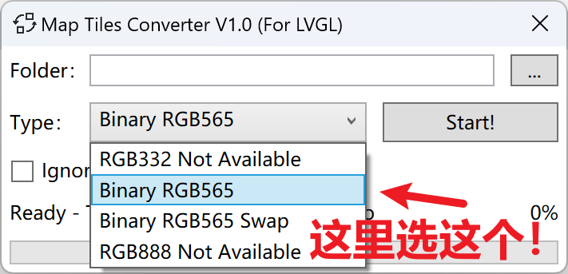

### 关于MAP
- 由于体积原因，请自行下载地图瓦片到此处！
- 原生项目`X-TRACK`的地图下载说明：[戳这儿!](https://github.com/FASTSHIFT/X-TRACK/tree/main/Tools)
- `Crimson/地图下载器`的下载地址：[在这儿!](https://gitee.com/CrimsonHu/java_map_download/)

### 注意事项
本项目与原生项目的地图下载大相径庭，跟着说明走就行，只有几点需要注意一下：

- 地图瓦片格式转换时注意选择`Binary RGB565`，否则在EasyGPS上显示是反色的效果。

- SD卡的内存应当 ≤ 32GB，SD卡需要格式化为FAT32格式。